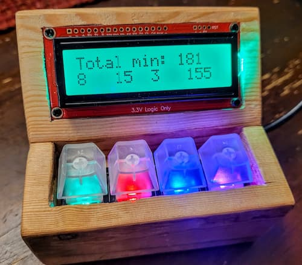

= Dave's RP2040 MultiTimer

A multiple-category project/productivity timer with pretty RGB-lit
MX-compatible keyboard keyswitches and backlit LCD output. Running a
ridiculously powerful (yet inexpensive) dual-core ARM processor.

== What's it made of?

Hardware:

* Raspberry Pi Pico microcontroller (RP2040 32-bit dual ARM Cortex-M0+)
* Adafruit NeoKey 1x4 QT I2C Breakout (Cherry-compatible keypad + NeoPixels)
* SparkFun SerLCD (RGB 16x2 LCD + AVR microcontroller with I2C, etc.)

== Software Runtime/VM

* link:http://docs.micropython.org/en/latest/rp2/quickref.html[MicroPython]
* `main.py` in this repo

I chose not to use any external libraries. But I referenced the Sparkfun
and Adafruit libraries for Python/Micropython/Circuitpython to write this.

== About

This scratched an itch for a hardware timer that I simply could not find
for sale: a minute-tracking stopwatch with a single category active at
any one time.

I expect to do a write-up on my website soon. Will post link here.
